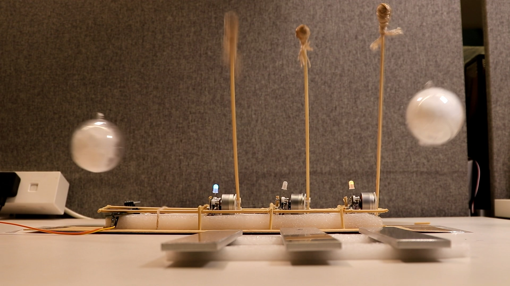

# Malletwand

**Malletwand** is a handheld controller device in the form of a pendulum, which can act as an input interface to the timing of musical playback.

We presented (or, will be presenting) this at [NIME](https://nime.org/) 2024 as a short paper ([PDF](paper/paper.pdf), video to-be-uploaded).

## Directory Structure

The following directories contain all the files for design and implementation (hardware, firmware, and mechanical).
- **wand/**: the handheld controller (the "Wand").
  - Hardware is a single PCB; firmware for the two controllers are in subdirectories **fw/** (the main one) and **fw_bob/** (the small one in the bob/ball).
- **mallet/**: one unit of the self-playing (robotic) glockenspiel instrument (the "Mallet").
- **mallet_central/**: the central unit for the instrument, mostly managing communications (both wireless and wired).

To use the files, the following software packages are required (versions for reference):
- Hardware: KiCad (7.0.10)
- Firmware: Arm GNU Toolchain (GCC 10.3.1), STM32Cube ('G0 1.5.0, 'L0 1.12.1), PlatformIO (6.1.15)
- Mechanical: FreeCAD (0.21.1)

The following directories contain miscellaneous resources:
- **numerical/**: Numerical experiments for the filtering algorithms, implemented in Julia.
- **paper/**: The paper's TeX source and affiliated images.
- **testdrive/**: A testbed prototype for the sensors used, created in the early days of development. Includes both hardware and firmware, and a desktop client to receive the BLE signals. Currently not well documented, but might be of interest.
- **releases/**: Gerber files submitted to PCB fabrication houses.

## Licence
All content in this repository is distributed under CERN-OHL-S (CERN Open Hardware Licence Version 2, Strongly Reciprocal). See full text at **COPYING.txt** or [online](https://ohwr.org/cern_ohl_s_v2.txt).
